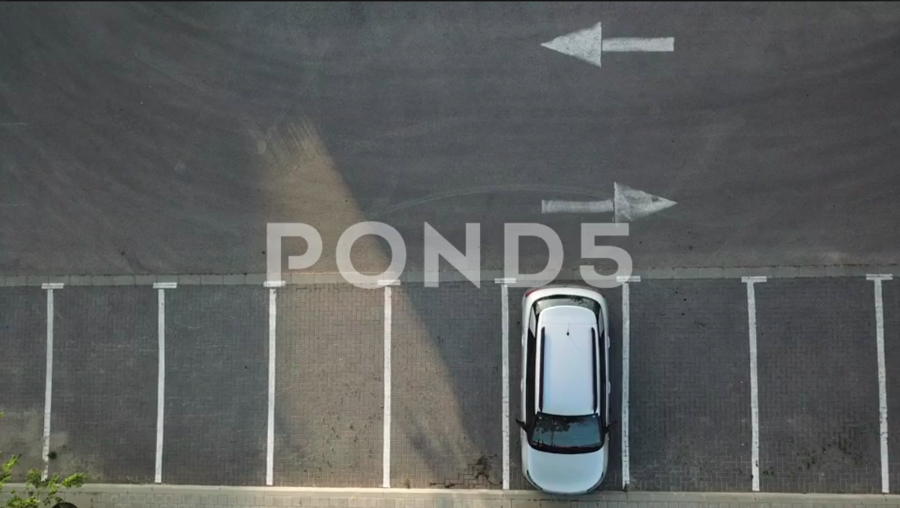

# Sistem Deteksi Parkir Ilegal dengan YOLOv8

Repositori ini berisi seperangkat alat dan skrip Python untuk mendeteksi pelanggaran parkir ilegal secara *real-time* dari rekaman video (misalnya, CCTV). Sistem ini menggunakan model deteksi objek **YOLOv8** untuk mengidentifikasi kendaraan dan menerapkan logika khusus untuk menandai pelanggaran berdasarkan zona terlarang yang telah ditentukan.

## Fitur Utama

-   **Deteksi Kendaraan**: Menggunakan model `YOLOv8s` yang telah dilatih sebelumnya untuk mendeteksi objek 'mobil'.
-   **Zoning Interaktif**: Dilengkapi dengan `zooning_tools.py` untuk menggambar dan mendefinisikan area parkir ilegal secara visual pada frame video.
-   **Multi-Object Tracking**: Mengimplementasikan **ByteTrack** untuk memberikan ID unik pada setiap kendaraan yang terdeteksi. Ini memungkinkan sistem untuk melacak setiap mobil secara konsisten, bahkan jika mobil tersebut bergerak atau tertutup sementara.
-   **Heatmap Pelanggaran**: Menghasilkan visualisasi *heatmap* secara dinamis di atas zona ilegal. Semakin lama atau sering sebuah area di dalam zona digunakan untuk parkir ilegal, semakin pekat warna heatmap-nya (merah).
-   **Penyimpanan Screenshot Pelanggaran**: Secara otomatis mengambil dan menyimpan *screenshot* (gambar .png) setiap kali pelanggaran parkir baru terdeteksi. *Screenshot* ini disimpan dengan *timestamp* dan ID pelacak untuk kemudahan pemantauan.
-   **Logging Pelanggaran**: Setiap pelanggaran (kendaraan yang berada di zona ilegal melebihi ambang batas waktu) dicatat ke dalam file log di folder `logs/` untuk analisis lebih lanjut.
-   **Konfigurasi Fleksibel**: Sumber video dan konfigurasi lainnya dapat dengan mudah diatur melalui file JSON (`config/cctv_sources.json`).

## Struktur Folder

```
/learn-yolo
├─── config/
│    ├─── bytetrack.yaml
│    ├─── cctv_sources.json
│    └─── hasil_zoning/
│         └─── parking_zones_nama_cctv.json
├─── hasil/
│    └─── deteksi_parkir_ilegal_yolo_nama_cctv_1.mp4
├─── logs/
│    ├─── nama_cctv_violations.log
│    └─── screenshots/
│         └─── nama_cctv/
│              └─── TAHUNBULANTANGGAL_JAMMENITDETIK_nama_cctv_vid_IDPELANGGAR.png
├─── model/
│    └─── yolov8s.pt
├─── .gitignore
├─── yolo_parking_ilegal_detection.py
├─── zooning_tools.py
├─── timestamp_logger.py
└─── README.md
```

## Instalasi

Pastikan Anda memiliki Python 3.8+ terinstal. Kemudian, instal semua dependensi yang dibutuhkan dengan menjalankan perintah berikut:

```bash
pip install ultralytics opencv-python numpy loguru
```

Anda juga perlu mengunduh model `yolov8s.pt` dan meletakkannya di dalam folder `model/`.

## Cara Penggunaan

Sistem ini memerlukan dua langkah utama: (1) mendefinisikan zona parkir ilegal, dan (2) menjalankan deteksi pada video.

### Langkah 1: Konfigurasi Sumber Video

Sebelum memulai, daftarkan terlebih dahulu sumber video Anda di dalam file `config/cctv_sources.json`. Buka file tersebut dan tambahkan entri baru dengan format `nama_unik: "path/to/video.mp4"`.

**Contoh `config/cctv_sources.json`:**
```json
{
  "btm_kota_bogor": "path/ke/video_cctv_1.mp4",
  "jembatan_otista": "path/ke/video_cctv_2.mp4",
  "lokasi_baru": "video/lokasi_baru.mp4"
}
```

### Langkah 2: Membuat Zona Parkir Ilegal

Gunakan skrip `zooning_tools.py` untuk menggambar poligon zona terlarang pada frame pertama video.

**Jalankan Perintah:**
Gantilah `nama_cctv` dengan nama unik yang Anda daftarkan di `cctv_sources.json`.

```bash
python zooning_tools.py <nama_cctv>
```
**Contoh:**
```bash
python zooning_tools.py btm_kota_bogor
```

**Kontrol Interaktif:**
-   **Klik Kiri**: Menambahkan titik untuk poligon zona.
-   **Klik Kanan**: Menghapus titik terakhir yang ditambahkan.
-   **Tekan 'c'**: Menyelesaikan zona saat ini (minimal 3 titik).
-   **Tekan 'z'**: Menghapus zona terakhir yang sudah selesai.
-   **Tekan 's'**: Menyimpan semua zona ke dalam file JSON. File akan disimpan di `config/hasil_zoning/parking_zones_<nama_cctv>.json`.
-   **Tekan 'q'**: Keluar dari alat.

### Langkah 3: Menjalankan Deteksi Parkir Ilegal

Setelah file zona berhasil dibuat, jalankan skrip utama `yolo_parking_ilegal_detection.py` untuk memulai proses deteksi.

**Jalankan Perintah:**
Sama seperti sebelumnya, gantilah `<nama_cctv>` dengan nama yang sesuai.

```bash
python yolo_parking_ilegal_detection.py <nama_cctv>
```
**Contoh:**
```bash
python yolo_parking_ilegal_detection.py btm_kota_bogor
```

Sistem akan memproses video, dan jendela pratinjau akan muncul menampilkan deteksi secara *real-time*. Video hasil akhir akan disimpan secara otomatis di dalam folder `hasil/`.

## Contoh Hasil Output

Berikut adalah deskripsi dari hasil visual yang akan ditampilkan:

-   **Zona Ilegal**: Area parkir terlarang akan ditandai dengan lapisan warna merah transparan.
-   **Bounding Box Kendaraan**:
    -   **Hijau**: Kendaraan terdeteksi di luar zona ilegal.
    -   **Oranye**: Kendaraan terdeteksi di dalam zona ilegal, tetapi durasinya belum mencapai ambang batas pelanggaran.
    -   **Merah**: Kendaraan terdeteksi sebagai pelanggaran (melebihi ambang batas waktu).
-   **Label Informasi**: Setiap kendaraan akan memiliki label yang menampilkan:
    -   Nama kelas (misal: `car`).
    -   ID unik dari tracker (misal: `ID: 23`).
    -   Durasi berada di zona ilegal (misal: `00:15`).
-   **Heatmap**: Di dalam zona ilegal, akan muncul gradasi warna dari biru ke merah. Area yang sering menjadi titik pelanggaran parkir dalam waktu lama akan berwarna lebih merah dan pekat.
-   **Screenshot Pelanggaran**: Setiap *screenshot* pelanggaran akan disimpan di `logs/screenshots/nama_cctv/` dengan nama file yang mencakup *timestamp* dan ID kendaraan, misalnya: `20231027_143005_btm_kota_bogor_vid_12.png`.


*Gambar: Ilustrasi hasil deteksi dengan zona, bounding box, dan heatmap.*
